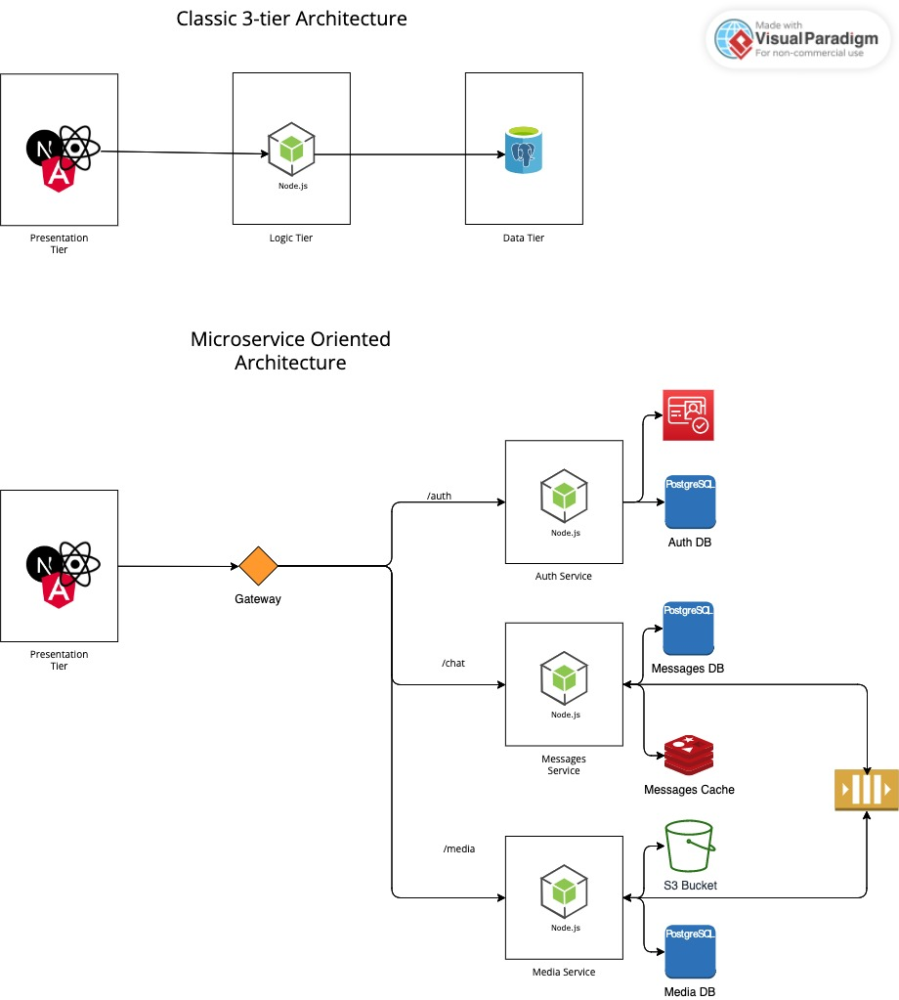
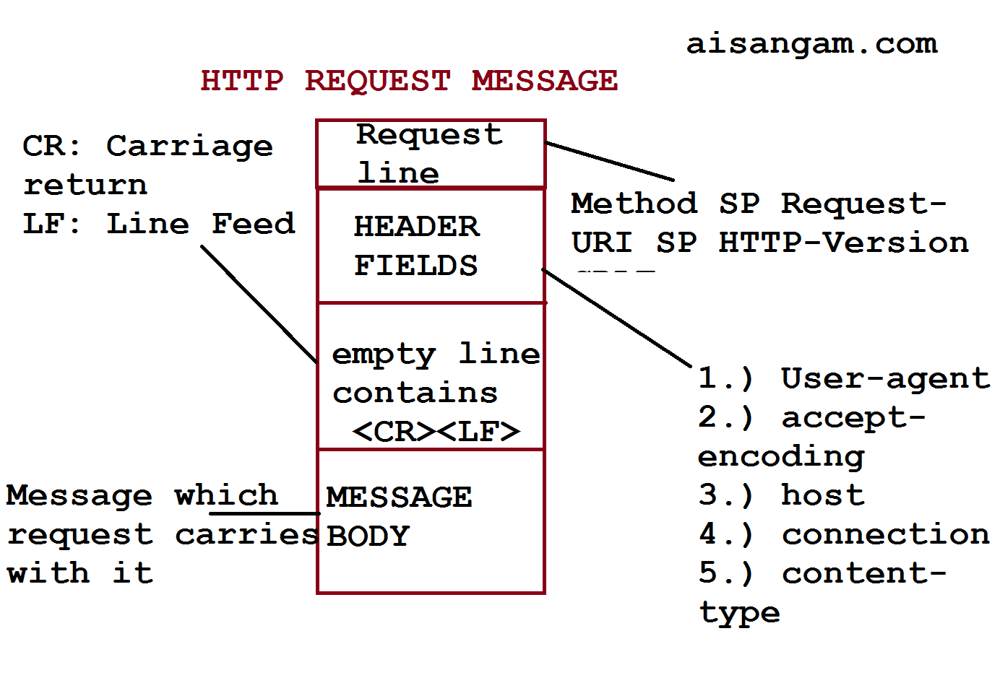
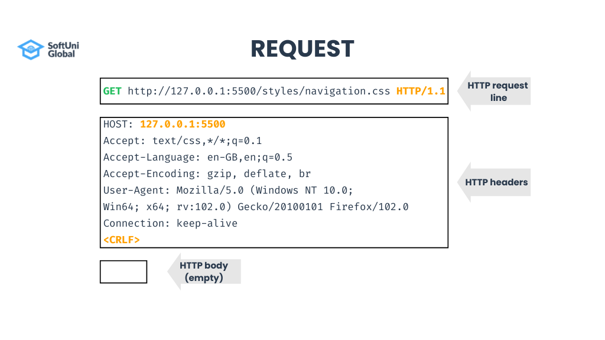
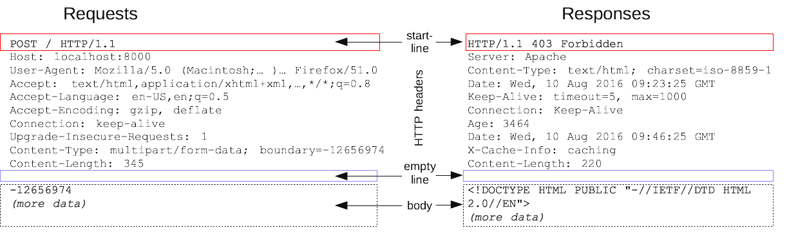

# Start with a simple JavaScript Server

This part will present the steps to initialize a simple JavaScript server with Express.

## 1. Init the project

```
mkdir mpp-backend
cd mpp-backend/
npm init
```

Answer to the questions that pop up and done (usually just yes/leave the defaults).

## 2. Add Express

`npm i express dotenv`

Or using Yarn:

`yarn add express dotenv`

## 3. Create the env variables file

Create a file named `.env` at the same level as package.json.
In this file we will put our settings, secrets, keys, URLs...

**DO NOT HARDCODE THOSE THINGS!**

**DO NOT PUSH THIS FILE TO THE REPO!**

Add this file in the `.gitignore` file

```
PORT=3000
```

## 4. Create a demo server

```
const express = require('express');
const dotenv = require('dotenv');

dotenv.config();

const app = express();
const port = process.env.PORT;

app.get('/', (req, res) => {
  res.send('Express + TypeScript Server');
});

app.listen(port, () => {
  console.log(`[server]: Server is running at http://localhost:${port}`);
});
```

**Disclaimer:** If you want to use `import` statements instead of `require` you need to go to `package.json` and add `"type": "module"`. Inside it.

Also you can add a new _start_ command:

```
{
  // package.json contents...

  "scripts": {
    // might have other commands or scripts

    "start": "node index.js"
  }
}
```

# Convert to a TypeScript project

## 1. Install Typescript, Types and other dependencies.

`npm i typescript @babel/preset-typescript @types/express @types/node -D`

Or yarn:

`yarn add typescript @babel/preset-typescript @types/express @types/node -D`

## 2. Generate the configuration file for TypeScript

`npx tsc --init`

Some questions might pop up, say yes to all. If not, just go to tsconfig.json and check the settings.

- target: Enables the specification of the target JavaScript version that the compiler will output
- module: Facilitates the utilization of a module manager in the compiled JavaScript code, CommonJS is supported and is a standard in Node.js
- strict: Toggles strict type-checking protocols
- esModuleInterop: Enables the compilation of ES6 modules to CommonJS modules
- skipLibCheck: When set to true, bypasses type-checking of default library declaration files
- forceConsistentCasingInFileNames: When set to true, enforces case-sensitive file naming

Uncomment outDir and set it to the following:

```
"outDir": "./dist"
```

TS will use this directory to compile the project to JavaScript.

## 3. Convert the simple Express project to TypeScript:

`index.ts`

```
import express, { Express, Request, Response } from "express";
import dotenv from "dotenv";

dotenv.config();

const app: Express = express();
const port = process.env.PORT;

app.get("/", (req: Request, res: Response) => {
  res.send("All good!");
});

app.listen(port, () => {
  console.group();
  console.log(`Server started at port ${port}`);
  console.groupEnd();
});

export default app;
```

You might get an error when trying to run this. Just add **ts-node**.

`npm i -g ts-node` or `yarn add -g ts-node`

# Let's test it!

This section will describe the steps in order to test your project.

## 1. Install Jest and all its dependencies

`npm i jest @types/jest @types/supertest babel-cli babep-preset-env superagent supertest ts-jest -D`

or yarn

`yarn add jest @types/jest @types/supertest babel-cli babep-preset-env superagent supertest ts-jest -D`

## 2. Create a Unit Test

`test/get.spec.ts`

```
import request from "supertest";
import app from "../index";

describe("Test the root path", () => {
  test("It should response the GET method", (done) => {
    request(app)
      .get("/")
      .then((response) => {
        expect(response.statusCode).toBe(200);
        done();
      });
  });
});
```

## 3. Add a test script in `package.json`

```
{
  // package.json stuff

  "scripts": {
    // other scripts

    "test": "jest test/*",
  }
}
```

run with `npm run test` or simply `yarn test`.

# Other stuff/offtopics

Designed in the early 1990s, HTTP is an extensible protocol which has evolved over time. It is an application layer protocol that is sent over TCP, or over a TLS-encrypted TCP connection, though any reliable transport protocol could theoretically be used. Due to its extensibility, it is used to not only fetch hypertext documents, but also images and videos or to post content to servers, like with HTML form results. HTTP can also be used to fetch parts of documents to update Web pages on demand.
[[Source - PLEASE CHECK](https://developer.mozilla.org/en-US/docs/Web/HTTP/Overview)]






